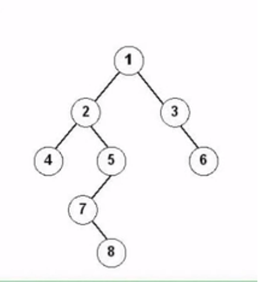
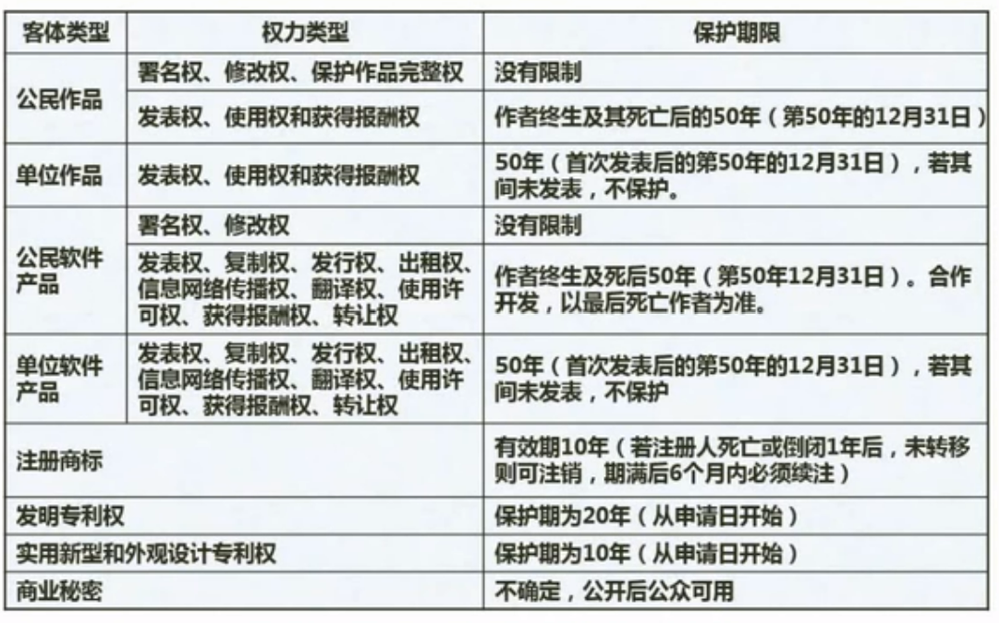
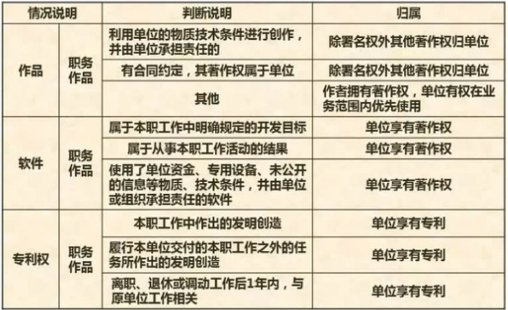
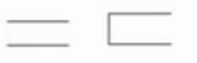

##### 计算机结构

CPU + 主存储器

CPU 包含 运算器 + 控制器

###### 运算器

1. 算术逻辑单元ALU
2. 累加寄存器AC
3. 数据缓冲寄存器DR
4. 状态条件寄存器PSW

###### 控制器

1. 程序计数器PC
2. 指令寄存器IR
3. 指令译码器
4. 时许部件

##### 计算机体系结构分类 ---- Flynn

|     体系结构类型     |      结构      | 关键特性 |        代表        |
| :-------------------: | :------------: | :------: | :----------------: |
|  单指令流数据流 SISD  | 控制部分: 一个 |          |    单处理器系统    |
| 单指令流多数据流 SIMD |  控制器：一个  |          |                    |
| 多指令流单数据流 MISD |   多个控制器   |          |    理论上不存在    |
| 单指令流多数据流 MIMD |   多个控制器   |          | 市面上最常用的电脑 |

##### 磁盘存取时间计算

存取时间 = 寻道时间 + 等待时间(平均定位时间 + 转动延迟时间)

流水线模式：执行第一条需要的时间 + （执行的条数 - 1） * 执行最长事件的时间

##### 总线的基本概念

1. 内部总线
2. 系统总线 （数据总线、地址总线、控制总线）
3. 控制总线

**数字证书**对用户进行身份认证

**数字签名**确保信息不可抵赖

数据流图建模应当遵循自顶向下，从抽象到具体

##### 系统可靠度分析

进程的所有资源，线程都可以共享，栈指针不能共享

###### 串联

可靠度计算：R = R1 * R2 * ... * Rn

失效度计算：1 - 可靠度 = 失效度

###### 并联

可靠度计算：R = 1 -（可靠度）

##### 进程管理

运行 --> 就绪 --> 等待

###### PV操作

P操作允许阻塞进程 直到V 操作唤醒 被阻塞的进程

V操作不允许阻塞进程

##### 大数据的重要特征

1. 高度可扩展性
2. 高性能
3. 高度容错
4. 支持异构环境
5. 较短的分析延迟
6. 易用且开放的接口
7. 较低的成本
8. 向下兼容性

##### OSI/RM七成模型

1. 物理层（二进制传输）
2. 数据链路层（传输以帧为单位的数据）
3. 网络层（分组传输和路由选择）
4. 传输层（端到端链接）
5. 会话层（建立、管理和终止对话）
6. 表示层（数据的格式与表达、加密、压缩）
7. 应用层（实现应用功能）

##### 网络标准协议

TCP/IP协议： Internet 可扩展，可靠，应用最广，牺牲速度和效率

IPX/SPX协议：NOVELL，路由，大型企业网

NETBEUI协议：LBM，非路由，快速

##### 常见网络拓扑结构

1. 总线型
2. 星型
3. 环型
4. 网状型

##### 网络规划与设计 -- 分层设计

1. 接入层：像本地网段提供用户接入
2. 汇聚层: 网络访问策略控制、数据包处理、过滤、寻址
3. 核心层：数据交换

##### IP地址

1. A类地址：0 - 127
2. B类地址：128 - 191
3. C类地址：192 - 223
4. D类地址：224 - 239
5. E类地址：240 - 255

##### 无线网

1. 无线局域网
2. 无线城域网
3. 无线广域网

##### 对称加密技术

只有一种解密方式（不安全）

##### 对称密钥算法

1. DES
2. 3DES
3. RC-5
4. IDEA
5. AES
6. RC4

##### 非对称加密

1. RSA
2. ECC
3. DSA

##### 非对称加密

使用公钥加密，使用私钥解密（安全）缺点: 加密速度慢

##### 信息摘要技术

第三方无法串改，截取一段信息判断是否一致，能匹配则说明没有被篡改

##### 数字签名

需要使用发送方的私钥生成唯一标识，具有不可抵赖性

#### 数据结构与算法

##### 数组与矩阵

存储地址计算

一维数组：a _ i * len (i) 为数组的下标

二维数组：

1. 按行存储 a + (i * n +j) * len (i为数组下标，j 为数组在数组内的下标，n 为总行数 len为元素占用的字节数)
2. 按列存储 a + (j + m + i) * len  （i为数组下标，j 为数组在数组内的下标，m 为总列数 len为元素占用的字节数)

##### 线性表

###### 线性表： 顺序存储与链式存储的区别

空间性能：

| 性能类别 | 具体项目 |                 顺序存储                 |                 链式存储                 |
| :------: | :------: | :---------------------------------------: | :--------------------------------------: |
| 空间性能 | 存储密度 |                = 1， 更优                |                   < 1                   |
|          | 容量分配 |                 事先确定                 |              动态改变，更优              |
| 时间性能 | 查找运算 |                  0(n/2)                  |                  0(n/2)                  |
|          |  读运算  |                O(1)，更优                | O([n + 1] / 2)，最好情况为1，最坏情况为n |
|          | 插入运算 | O(n / 2)，最好情况为 0，<br />最坏情况为n |               O(1)， 更优               |
|          | 删除运算 |              O([n - 1] / 2)              |               O(1)， 更优               |

###### 队列与栈

1. 队列（先进先出）
2. 栈（先进后出）

##### 广义表

广义表是 n 个元素组成的有限序列，是线性表的推广

通常使用递归的形式定义，记作： LS = （a0, a1,.....an） 其中LS表示表名

##### 树与二叉树

###### 结点的度

树的度（树的最大节点数）

叶子节点（没有子节点的节点）

分支节点（具有子节点的节点）

内部节点（不是叶子节点，也不是根节点）

父节点（相对子节点的父节点）

子节点（相对父节点的子节点）

兄弟节点（同一父节点的子节点）

层次（树的深度）

###### 二叉树的重要特征

1. 在二叉树的第i层上最多有 2的i - 1次方个节点（i >= 1）
2. 深度为K 的二叉树最多有 2的k次方 - 1 个节点（k >= 1）
3. 对于任何一颗二叉树，如果其叶子节点树为 no，度为2的节点数为n2，则no = n2 + 1
4. 如果对于一颗有n个结点的完全二叉树的节点按层序编号（从第1层到（log2n） + 1 层），（每层从左到右）

###### 二叉树遍历

1. 前序遍历 先访问根节点再访问左节点最后访问右节点  12457836
2. 中序遍历  42578136
3. 后序遍历 先访问左子树再访问右子树节点最后访问根节点 48752631
4. 层次遍历 根据层次依此访问 123456



前序：12457836

中序：42578136

后序：48752631

###### 反向构造二叉树

通过二叉树遍历的顺序得出二叉树结构

###### 哈夫曼树

特点：只有度为0和度为2的节点，且节点数为基数

##### 图

稳定排序

直接插入O(n²)，冒泡排序O(n²)，归并排序O(nlog2n)，基数排序

不稳定排序

shell排序，堆排序，快速排序，

##### 排序与查找

##### 算法基础及常见的算法

###### 算法的复杂度

1. 时间复杂度（执行算法需要的时间）
2. 空间复杂度（执行算法所需要的内存）

算法复杂度分析：

当算法中有一个循环时，程序复杂度为O(n)

当算法中有一个循环嵌套另一个循环时，程序复杂度为O(n²)

二叉树的程序复杂度为 O(nlog)

###### 查找

顺序查找：平均查找长度 （1 + n）/ 2

二分查找：时间复杂度 O(log2n)

散列表查找：h = key % p

###### 排序的概念

堆排序（最复杂的排序之一）

|   类别   | 排序方法 | 时间复杂度 | 时间复杂度 | 空间复杂度 |     稳定性     |
| :------: | :-------: | :--------: | :--------: | :--------: | :------------: |
|          |          |  平均情况  |  最坏情况  |  辅助存储  |     稳定性     |
| 插入排序 | 直接插入 |   O(n²)   |   O(n²)   |    O(1)    | **稳定** |
|          | Shell排序 |            |   O(n²)   |    O(1)    |     不稳定     |
| 选择排序 | 直接选择 |   O(n²)   |   O(n²)   |    O(1)    |     不稳定     |
|          |  堆排序  | O(nlog2n) | O(nlog2n) |    O(1)    |     不稳定     |
| 交换排序 | 冒泡排序 |   O(n²)   |   O(n²)   |    O(1)    |      稳定      |
|          | 快速排序 | O(nlog2n) |   O(n²)   | O(nlog2n) |     不稳定     |
| 归并排序 | 归并排序 | O(nlog2n) | O(nlog2n) |    O(n)    |      稳定      |
| 基数排序 | 基数排序 | O(d(r+n)) | O(d(r+n)) |   O(r+n)   |      稳定      |

##### 程序设计语言

稳定排序

冒泡排序 O(n²)、快速插入排序、归并排序、基数排序

不稳定排序：堆排序O(nlog2n)、希尔排序O(nlog2n)、快速排序O(nlog2n)、直接选择排序

###### 编译与解释

1. 源程序
2. 词法分析（检查关键字或标识符的拼写错误）
3. 语法分析（语法结构错误，例如：if底下跟的不是else而是其他关键字或末尾缺分号）
4. 语义分析（例如循环没有退出条件）
5. 中间代码的生成
6. 代码的优化
7. 目标代码生成
8. 目标程序（将源程序编译成计算机能够识别的程序）

###### 表达式（重点）

前缀表达式（+ab）

中缀表达式（a+b）

后缀表达式（ab+）

###### 传值与传址（重点）

| 传递方式 | 主要特征                                                                             |
| -------- | ------------------------------------------------------------------------------------ |
| 传值调用 | 形参取的是实参的值，形参的改变不会导致调用的实参的值发生改变                         |
| 引用调用 | 形参取的是实参的地址，相当于实参存储单元的地址引用，因此其值的改变同时改变了实参的值 |

###### 多种程序语言特点

1. Fortran语言（科学计算，执行效率高）
2. Pascal语言（为教学而开发的，表达能力强）
3. C语言（指针操作能力强，高效）
4. Lisp语言（函数式程序语言，符号处理，人工智能）
5. C++语言（面对对象，高效）
6. Java语言（面向对象，中间代码，跨平台）
7. C#语言（面对对象中间代码,.Net）
8. Prolog语言（逻辑推理，简介性，表达能力，数据库和专家系统）

##### 法律法规



##### 知识产权人确定



##### 多媒体容量计算

1. 图像容量计算1 (知道像素，位数)每个像素为16位，图像为 640 * 480 像素，容量为：640 * 480 *16 / 8 = 614400B
2. 图像容量计算2 (知道像素，色素)640 * 480像素，256色的图像，容量为：640 * 480 * log2(256) / 8 = 307200B
3. 音频容量计算（容量=采样帧率(Hz) * 量化/采样位数(位) * 声道数 / 8）
4. 视频容量计算（容量=每帧容量(Byte) * 每秒帧数 * 时间 + 音频容量 * 时间）

##### 开发模型


耦合类型描述

|  耦合类型  | 描述                                                                                                                         |
| :--------: | :--------------------------------------------------------------------------------------------------------------------------- |
| 非直接耦合 | 两个模块之间没有直接关系，它们之间的联系完全是通过主模块的控制和调用来实现的                                                 |
|  数据耦合  | 一组模块借助参数表传递简单数据                                                                                               |
|  标记耦合  | 一个模块通过参数表传递记录信息                                                                                               |
|  控制耦合  | 模块之间传递的信息中包含用于控制模块内部逻辑的信息                                                                           |
|  外部耦合  | 一组模块都访问同一全局简单变量，而且不是通过参数传递该全局变量的信息                                                         |
|  公共耦合  | 多个模块都访问同一个公共数据环境                                                                                             |
|  内容耦合  | 一个模块直接访问另一个模块的内部数据；一个模块不通过正常人口转到另一个模块内部；两个模块有一部分代码重叠；一个模块有多个人口 |

###### 软件开发模型

1. 瀑布模型（软件计划 -> 需求分析 -> 软件设计 -> 程序编码 -> 软件测试 -> 运行维护）缺点：需求不明确导致软件项目的失败，适用于需求明确或者二次开发的场景
2. 演化模型：
3. 增量模型：先完成一些模块，交给用户使用，对用户提出的问题做修改，后续将模块不断加入的项目内，直至完成项目，可以先将核心的模块开发出来
4. 螺旋模型：适用于大规模团队开发
5. 快速原型模型：将需求写成原型用于开发，可以快速确定需求
6. 喷泉模型：先完成项目，再上线迭代
7. V模型：在需求分析阶段就开始编写验收测试标准
8. 构建组装模型（CBSD）

###### 敏捷开发方法

适用于小型项目

水晶法：每一个项目都需要一套不同的策略

并列征求法：把每30天一次的迭代称为一个冲刺，并按需求优先级来实现产品

###### 敏捷开发模型

1. 自适应开发
2. 水晶方法
3. 特征驱动开发
4. SCRUM
5. 极限编程

###### 12个最佳实践

1. 计划游戏
2. 小型发布
3. 隐喻
4. 简单设计
5. 测试先行
6. 重构
7. 结对编程
8. 集体代码所有制
9. 持续集成
10. 每周工作40小时
11. 现场客户
12. 编码标准

结构化设计基本原则

1. 自顶向下、逐步求精
2. 信息隐蔽
3. 模块独立（高内聚、低耦合、复杂度）

##### 软件测试

动态测试

1. 黑盒测试（等价类划分、边界值分析、错误推测、因果图）
2. 白盒测试（基本路径测试、循环覆盖测试、逻辑覆盖测试）
3. 灰盒测试 （白盒测试和黑盒测试的结合）

静态测试

1. 桌前检查
2. 代码走查
3. 代码审查

##### McCade复杂度

有向环路复杂度公式：V(G) = m - n + 2

V(G)是有向复杂度中环路的个数， m是G中的向弧数，n是G中的节点数

##### 需求分析 -- OOA

对象

类（实体类、边界类、控制类）

抽象

封装

继承与泛化

多态

接口

消息

组件

模式和复用

##### 需求分析 -- OOA -- UML

静态图（结构）：类图、对象图、包图、组合结构图、构件图、部署图、制品图

动态图（行为）：用例图、顺序图/序列图、通信图/协作图、定时图、状态图、活动图、交互概览图

##### 数据流图（DFD）-- 重点/必考

|       元素       |                                               说明                                               | 图元                                             |
| :--------------: | :----------------------------------------------------------------------------------------------: | ------------------------------------------------ |
|      数据流      |  由一组固定成分的数据组成，表示数据的流向，每个数据流通常<br />有一个合适的名词反映数据流的含义  |  |
|       加工       | 加工描述了输入数据流到输出数据流之间的变更，也就是输入数据<br />流做了什么处理后变成了输出数据流 |  |
| 数据存储（文件） |   用来表示暂时存储的数据，每个文件都有名字，流向文件的数据流<br />表示写文件，流出的表示读文件   |  |
|     外部实体     |                                  指存在于软件系统外的人员或组织                                  |  |

###### 问答题

在绘制数据流图时，需要注意加工的绘制，请给出三种在绘制加工的输入、输出时可能出现的错误

1. 加工本身不合格
2. 出现黑洞或奇迹
3. 数据流命名的问题，输入流和输出流一致
4. 输入流经过加工不可能出现某种类型的输出流

##### 数据库设计

ER模型---实体间联系类型

1. 一对一联系（1：1）
2. 一对多联系（1：n）
3. 多对多联系（n：m）
4. 多元联系

##### UML建模

主要包括

1. 用例图（包含关系 `<include>`）(扩展关系 `<extend>`) (泛化关系)
2. 类图于对象图（填类名，填关系）
3. 顺序图
4. 活动图
5. 状态图
6. 通信图
7. 构件图

##### 数据结构和算法

分治法

回溯法

贪心法（快速得到满意的解，但不是最优解）

动态规划法

##### 数据库访问

数据库访问：JDBC（Java Database Connectivity,java数据库连接）

JAVA类的定义

接口定义

实现接口 implements

interface IFactory interface

class SqlServerFactory implements IFactory

abstract Shape

public void

extends IDepartment

implements

interface Drawing

策略模式：定义一系列算法，把他们一个个封装起来，并且使他们可以相互替换

状态模式：允许一个对象在其内部状态改变时改变他们的行为

观察者模式：当一个对象的状态发生改变时，依赖于它们的对象都能得到通知并自动更新

命令模式：将一个请求封装为对象，从而可以用不同的请求对客户进行参数化

数据库赋值语句

GRANT ***INSERT ON*** TABLE Students TO User1** *WITH GRANT OPTION***

邻接表

SNMP传输层协议采用UDP

在程序执行过程中，高速缓存与主存间的地址映射是由硬件自动完成的

RIP：内部网关协议

OSPF:内部网关协议

BGP:外部网关协议

TCP：作用于传输层的传输协议（可靠连接）

UDP:不可靠无连接传输协议（效率高，不安全）

windows获取某个网络端口所对应的程序信息可以使用：***netstat***

数据字典就是为了数据流图中的每个数据流，文件，加工，和组成做出相应的说明

栈适用于递归调用

通信内聚指所有处理元素都在同一个数据结构上操作

软件可靠性：MTTF / (1 + MTTF)  MTTF 可靠性

软件可用性：MTBF / (1 + MTBF)  MTBF 可用性

软件可维护性：1 / （1 + MTTR）MTTR 可维护性

##### 创建型模式

1. **原型**（**Prototype**）：用原型实例指定创建对象的种类，并且通过拷贝这些原型创建新的对象
2. **生成器模式：**将一个复杂构建与他的表示分离，使用同样的创建过程可以创建不同的表示形式（还是这个 `饺子店`的后厨，厨师（实现类）根据客户的不同的备注需求（导演类），调整食材的咸淡或烹饪顺序，灵活变通生产出满足客户不同需求的产品（产品类））
3. 单例模式：一个类只有一个实例，一个全局访问点

##### 结构型开发模式列表

1. ****桥接模式：****将抽象与实现分离，使它们可以独立变化。它是用组合关系代替继承关系来实现，从而降低了抽象和实现这两个可变维度的耦合度。
2. **适配器模式：**将一个类的接口转化为用户希望的接口
3. **代理模式(Proxy)** ：为某对象提供一种代理以控制对该对象的访问。即客户端通过代理间接地访问该对象，从而限制、增强或修改该对象的一些特性。

##### 行为型开发模式列表

1. **观察者模式**：定义对象存在一种一对多的依赖关系，当一个对象的状态发生改变时，所有依赖它的对象都会得到通知并被自动更新
2. **命令模式**：根据命令执行对应的行为
3. **状态模式**：允许一个对象在其内部状态发生改变时改变其行为能力，当状态发生改变时所依赖的的对象也会发生改变
4. **策略模式**：将一系列算法封装起来，并使他们可以相互替换，适用于需要使用一个算法的不同变体场景
5. **访问者模式**：在不改变集合元素的前提下，为一个集合中的每个元素提供多种访问方式，即每个元素有多个访问者对象访问。
6. **解释器模式**：对语法做出相关的解释，即解释器
7. **中介者模式：**用一个对象来封装一系列的对象交互，使用户对象和组对象不需要显式的相互作用，从而是其耦合松散，而且可以独立的改变他们之间的交互

设置虚拟世界（Run Robots）

编辑器（Editor）

文件导入系统（Load File）

建立虚拟世界（Setup World）

程序（Setup Program）

自动控制（Run）

探索（Run Program）

```java
void buy(double money, WebService  service)

WebServiceMediotar

abstract void buyService(double money)

mediator.buy(money, this)

mediator.buy(money, this)
```

CPU主要由运算器、控制器、寄存器组和内部总线等部件组成

栈帧的不包括全局变量

##### 耦合

标记耦合：两个模块之间传递的数据是数据结构

外部耦合：一组模块都访问同一全局简单变量而不是同一全局数据结构，而且不是通过参数表传递该全局变量的信息，则称之为外部耦合。

数据耦合：两个模块之间有调用关系，传递的是简单数据值相当于高级语言中的值传递

公共耦合：通过一个公共数据环境相互作用的那些模块间的耦合

内容耦合：

（1）一个模块直接访问另一个模块的内部数据；
（2） 一个模块不通过正常入口转到另一模块内部；
（3）两个模块有一部分程序代码重叠（只可能出现在汇编语言中）；
（4）一个模块有多个入口。

覆盖方法：语句覆盖 --> 判定覆盖 -- > 条件覆盖 -- > 判断/条件覆盖 -- > 条件组合 --> 路径覆盖

立即寻址最快，寄存器寻址最慢，直接寻址次之

主存的编址

存取时间 = 寻道时间 + 等待时间

相连存储器按内容访问

##### 内聚

偶然内聚：指一个模块内的各处理元素之间没有任何联系

逻辑内聚：指模块内执行若干逻辑上相似的功能，通过参数确定该模块的哪一个功能

时间内聚：把需要同时执行的动作组合在一起形成的模块称为时间内聚模块

过程内聚：指一个模块完成多个任务，这些任务必须按指定的过程执行

通信内聚：所有处理元素集中在一个数据结构的区域上

| 内聚类型 | 描  述                                      |
| -------- | -------------------------------------------- |
| 功能内聚 | 完成一个单一功能，各个部分协同工作，缺一不可 |
| 顺序内聚 | 处理元素相关，而且必须顺序执行               |
| 通信内聚 | 所有处理元素集中在一个数据结构的区域上       |
| 过程内聚 | 处理元素相关，而且必须在同一时间间隔内执行   |
| 瞬时内聚 | 所包含的任务必须在同一时间间隔内执行         |
| 逻辑内聚 | 完成逻辑上相关的一组任务                     |
| 偶然内聚 | 完成一组没有关系或松散关系的任务             |

语法分析阶段的输入是记号流

指向自己P操作，指向别人V操作

柱面操作：先移臂，再旋转

磁盘调度时：先进行移臂调度，再进行旋转调度

访问同一个磁盘时：只需要旋转调度就行

0-1背包，矩阵链乘，最长公共子序列可以使用动态规划法可以求到最优解

部分分数背包可以使用贪心算法求到最优解

MIME可以在邮件发送时附带其他类型文件

POP3:接收协议  SMTP:发送协议

PCI总线是并行内总线 SCSI总线是并行外总线

IGMP不能用于远程登入

聚合:部分脱离整体还能单独存在

组合: 主体消失后部分也会消失

是否构成小顶堆和大顶堆

15，25，21，53，73，65，33

第一个元素15 和第二个元素25和第三个元素21比较

第二个元素25和第四个元素53和第五个元素73比较

第三个元素21和第六个元素65和第七个元素33比较

ARP Request通过广播进行传输

ARP Response 通过单播进行传输

C4:近距离传感器C3:前向传感器 C5:机器人 C6: 小精灵  C7:幽灵

abstract: 抽象

implements: 继承

public abstract void draw()

Price

Price

price.draw()

price.draw()


E1: 检测设备 E2：管理员 E3: 检测业务员 E4: 监控人员

D1: 模型信息表 D2:监测信息表 D3:基础信息表

E3 ---> P5 远程控制命令


分公司 --- 业务部 1：*

分公司 --- 经理 1：1

业务部 --- 主管 1：1

业务部 --- 职员 1：*


a: 经理号

b: 地址,分公司编号，主管号

c:所属业务部编号


分公司主键：分公司编号，外键：经理号

业务部主键：业务部编号 外键：分公司编号，主管号


造成多条记录的家庭成员的冗余，应当再创建一个家庭成员表，通过家庭成员的索引查询家庭成员


a:部门负责人

b:培训师

c:新员工

部门 -- 员工 1:*  联系类型：属于

d:岗位、基本工资

e:课程号，培训师id

f:培训师id,新员工号

主键：员工号 外键：部门号

存在

《inclu》《extend》

C1：房产 C2: 住宅 C3:公寓

C4:用户 C5:系统管理员 C6:房产经纪人
